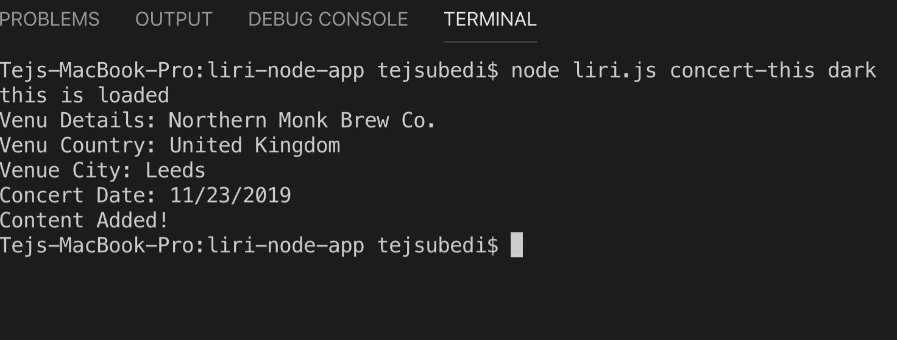

# liri-node-app

#Packages added to the file
**install the npm init-y**
**install the npm install dotenv**
**install the npm install axios**
**added .gitignore file**

# Purpose of this project

This project is about mimic of Siri which takes a command line node app that takes in parameters and gives you back data. 

# How to operate
**To operate this project it will take some of the commands from command prompt are as follows:**
* `concert-this`

* `spotify-this-song`

* `movie-this`

* `do-what-it-says`

## What each command should do 

**1.`node liri.js concert-this <artist/band name here>` will genereate in terminal**

* Name of the venue

* Venue location

* Date of the Event (use moment to format this as "MM/DD/YYYY")

#Image

**2.`node liri.js spotify-this-song '<song name here>'` will genereate in terminal**

* Artist(s)

* The song's name

* A preview link of the song from Spotify

* The album that the song is from

* If no song is provided it will default to "The Sign" by Ace of Base.

**3.`node liri.js movie-this '<movie name here>'` will genereate in terminal**

* Title of the movie.

* Year the movie came out.

* IMDB Rating of the movie.

* Rotten Tomatoes Rating of the movie.

* Country where the movie was produced.

* Language of the movie.

* Plot of the movie.

* Actors in the movie.

* If no user input will output data for the movie Mr.Nobody.

**4.`node liri.js do-what-it-says` will genereate in terminal**

* Liri will take the text inside of random.txt.

* Liri will call one of the Liri's command. 

# Challenges Faced

 - Find the right api conncetion to facilitate the data search as users choices 

# Technology Used
 **JavaScript, Node, Moment.js, NPM: axios, dot.env and API**

# Future Enhancements
 - Add some more API and make it more user friendly

# Deployment
 - This game is deployed to Github: Tej Subedi